# Carnation Environmental Monitor — IoT Sensor Prototype

An ESP32-based environmental monitor built for tracking growing conditions
(temperature, humidity, and air quality) for carnations. The device reads
three sensors, shows a live status on an LCD, and streams every reading to
InfluxDB Cloud as time-series data, which is visualised on a live dashboard.

## 1. Device Architecture

| Component | Role |
|---|---|
| ESP32 DevKit V1 | Microcontroller, WiFi, HTTP client |
| DHT22 | Temperature & humidity sensor
| MQ-5 gas sensor | Air quality / gas concentration sensor |
| 16x2 LCD (I2C backpack) | Local status display |

Every 20 seconds the firmware:
1. Reads temperature and humidity from the DHT22, and a raw analog gas
   reading from the MQ-5.
2. Classifies temperature and humidity as `LOW`, `OK`, or `HIGH` against
   fixed thresholds (18–28 °C, 40–70 % RH).
3. Refreshes the LCD with the latest readings and status flags.
4. Prints a log line to the serial monitor.
5. Writes the reading as an InfluxDB line-protocol point over HTTPS.

## 2. Simulated Prototype (Wokwi)

The circuit was simulated end-to-end on Wokwi, including real internet
access from the simulated ESP32 to InfluxDB Cloud.

**Public project link:** https://wokwi.com/projects/468257829910217729

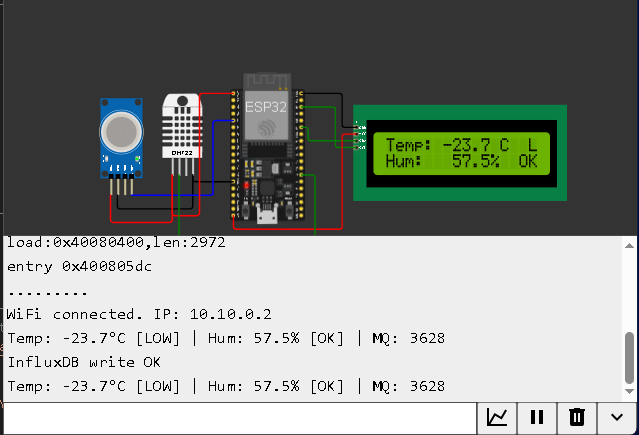

The serial monitor confirms WiFi connection, sensor readings, and successful
writes to InfluxDB:

```
WiFi connected. IP: 10.10.0.2
Temp: -23.7°C [LOW] | Hum: 57.5% [OK] | MQ: 3628
InfluxDB write OK
```

> Note: the simulated DHT22's default reading was left at a cold value
> (`-23.7 °C`), which is why the `temp_status` field reads `LOW` in the
> screenshots below, this exercises the low-temperature alert branch of
> the firmware logic.

## 3. Firmware

All firmware files are included in this repository:

- [`sketch.ino`](./sketch.ino) — main Arduino sketch (WiFi, sensors, LCD, InfluxDB write)
- [`diagram.json`](./diagram.json) — Wokwi wiring diagram
- [`libraries.txt`](./libraries.txt) — Arduino libraries used in the simulation

## 4. Time-Series Storage — InfluxDB Cloud

- **Platform:** InfluxDB Cloud
- **Organisation:** `Dev_team`
- **Bucket / measurement:** `carnation_monitor`
- **Tag:** `device = esp32_01`
- **Fields written per point:**
  | Field | Type | Description |
  |---|---|---|
  | `temperature` | float (°C) | DHT22 reading |
  | `humidity` | float (%) | DHT22 reading |
  | `air_quality` | integer | Raw MQ-5 ADC value (0–4095) |
  | `temp_status` | string | `LOW` / `OK` / `HIGH` |
  | `hum_status` | string | `LOW` / `OK` / `HIGH` |

Writes are performed with an HTTPS `POST` to the InfluxDB v2 write API
(`/api/v2/write`) using line protocol, authenticated with an API token.

### Proof of stored data


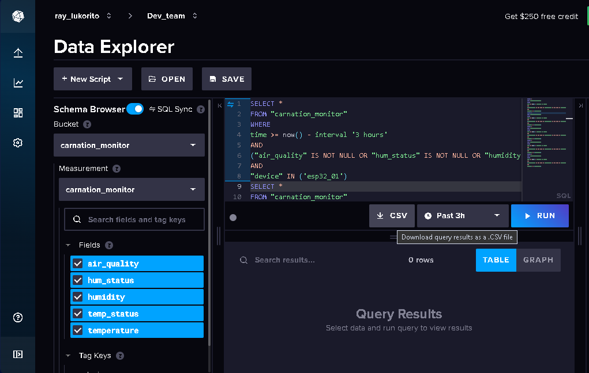

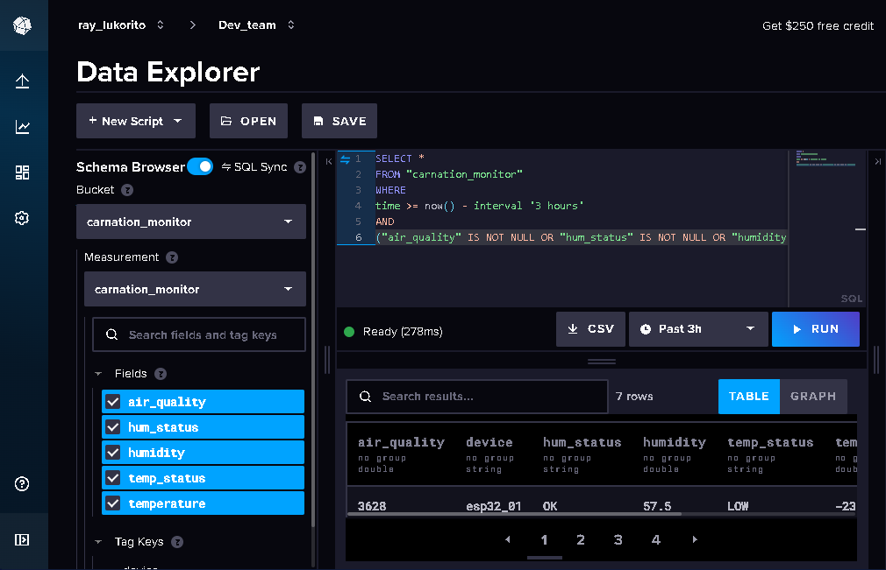

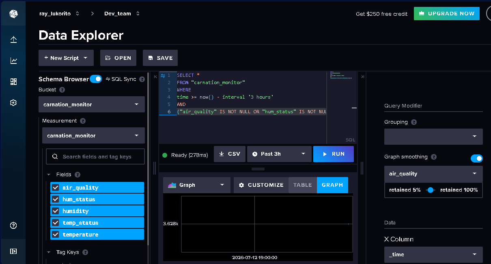

A wider 6-hour window confirms multiple points have accumulated over time:

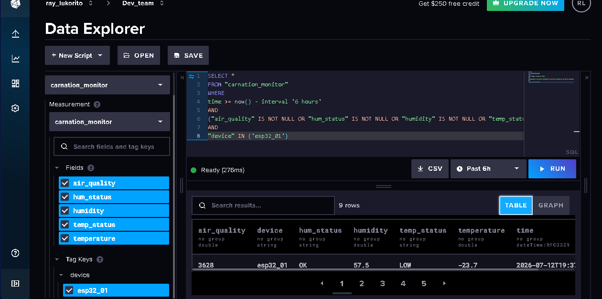

Cross-checking individual fields with the Flux-based query builder:

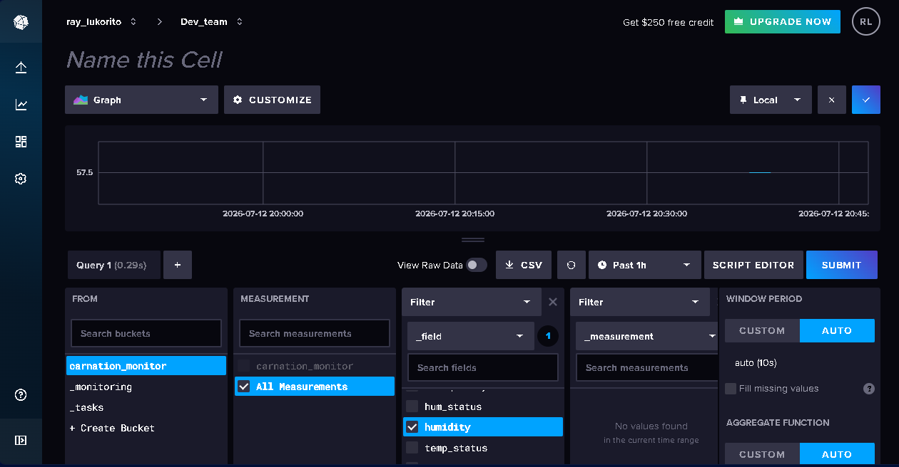

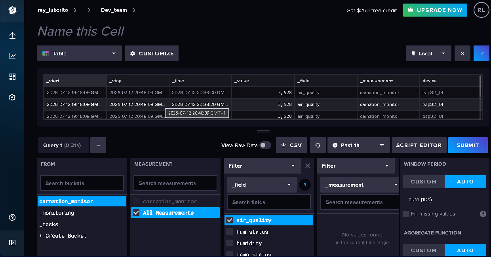

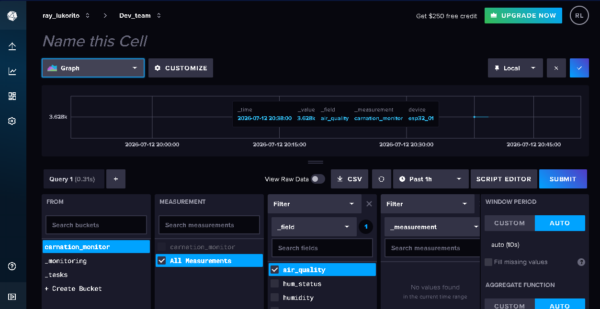

## 5. Visualisation Dashboard

A dashboard with **three time-series panels** was built directly on
InfluxDB Cloud (an InfluxDB-native alternative to Grafana, per the
assignment's "any other suitable cloud platform" allowance):

1. **Air Quality** — MQ-5 raw ADC value over time
2. **Humidity** — DHT22 relative humidity (%) over time
3. **Temperature** — DHT22 temperature (°C) over time

All three panels are windowed to the same 30-day range and share the same
`device = esp32_01` source data.

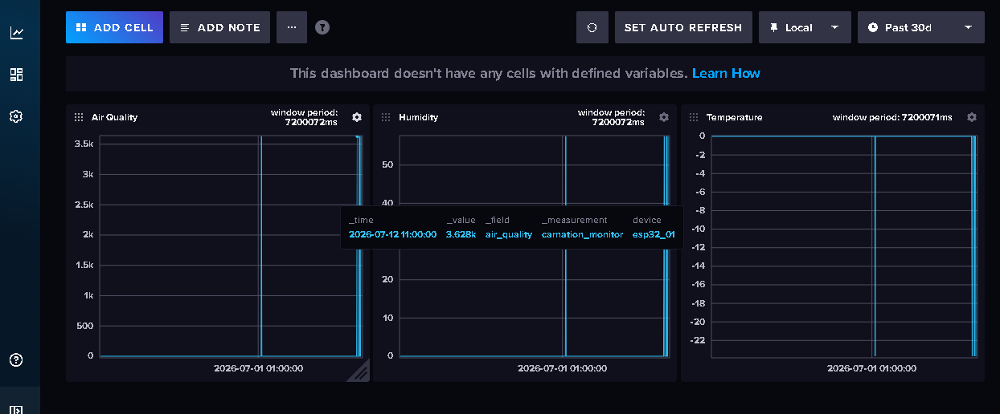

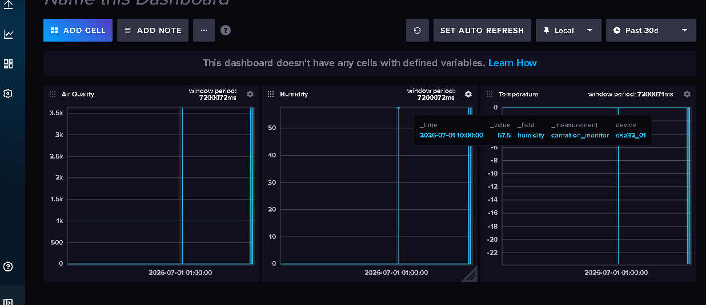

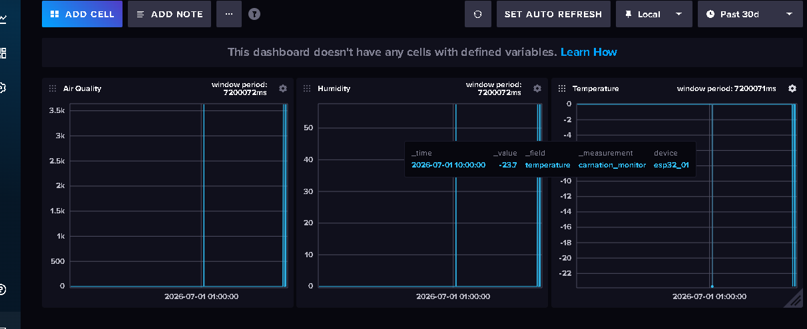

## 6. Proof of Collaboration

The team met to discuss the project requirements, divide tasks, and work
through implementation together.


